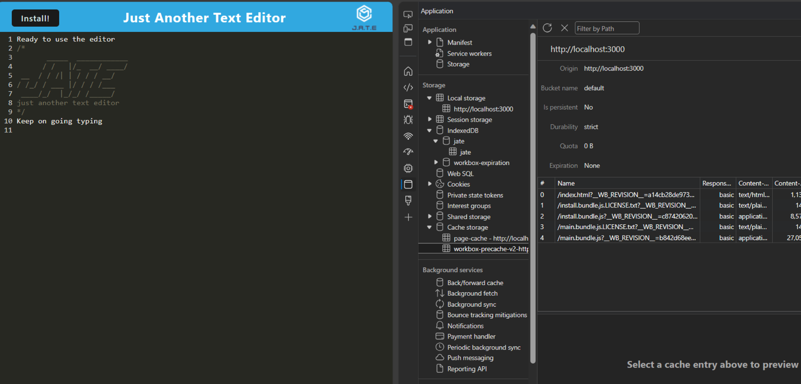
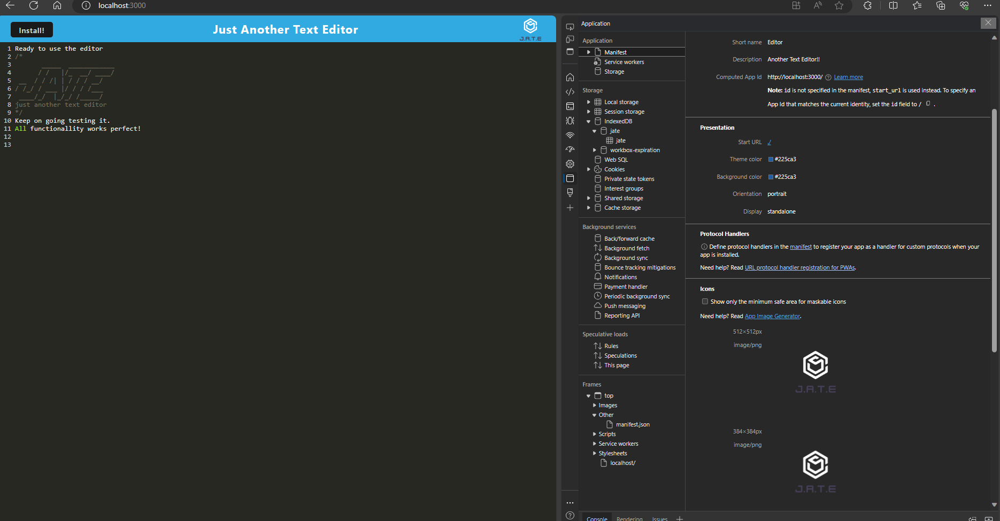
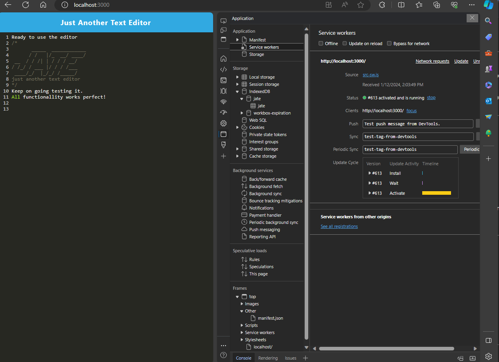
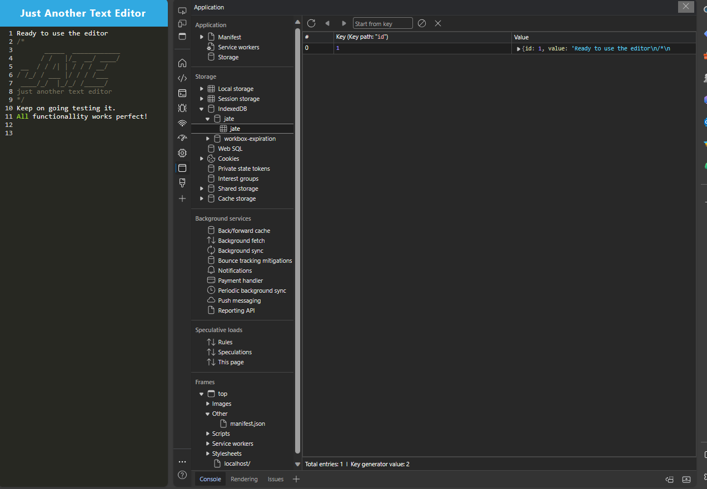

# pwatexted Text Editor

## link to Repo
[link to GGL repository url github](https://github.com/GonzaloGodinez/pwatexted)

## link to Heroku
[link to Heroku](https://ggl-texteditor-23f5063fdfe4.herokuapp.com/)

## Description
I created a text editor application using JavaScript files that have been bundled using webpack plugins and generated HTML file, service worker and a manifest file to run in the browser with the ability to run offline using cache and storing the data into IndexedDB API database to create  text. 

## Table of Contents

- [Installation](#installation)
- [Usage](#usage)
- [Sample](#Samples)
- [License](#license)

## Installation
1.	GUI bash terminal point using CD into project directory.
2.	Git clone this repo.
3.	CD into pwatexted.	
4.	Open using text editor, for VS Code, 
5.  At the command line type run npm i 
6.  At the command line type npm run start
7.	Application will start in the browser on the local host http://localhost:3000/
8.  Text editor is ready to be used

## Usage
Creates IndexedDB database.
View, Add, update and delete text in database.

## Samples

## License
MIT License

Copyright (c) 2023 GonzaloGodinez

Permission is hereby granted, free of charge, to any person obtaining a copy
of this software and associated documentation files (the "Software"), to deal
in the Software without restriction, including without limitation the rights
to use, copy, modify, merge, publish, distribute, sublicense, and/or sell
copies of the Software, and to permit persons to whom the Software is
furnished to do so, subject to the following conditions:

The above copyright notice and this permission notice shall be included in all
copies or substantial portions of the Software.

THE SOFTWARE IS PROVIDED "AS IS", WITHOUT WARRANTY OF ANY KIND, EXPRESS OR
IMPLIED, INCLUDING BUT NOT LIMITED TO THE WARRANTIES OF MERCHANTABILITY,
FITNESS FOR A PARTICULAR PURPOSE AND NONINFRINGEMENT. IN NO EVENT SHALL THE
AUTHORS OR COPYRIGHT HOLDERS BE LIABLE FOR ANY CLAIM, DAMAGES OR OTHER
LIABILITY, WHETHER IN AN ACTION OF CONTRACT, TORT OR OTHERWISE, ARISING FROM,
OUT OF OR IN CONNECTION WITH THE SOFTWARE OR THE USE OR OTHER DEALINGS IN THE
SOFTWARE.
---
